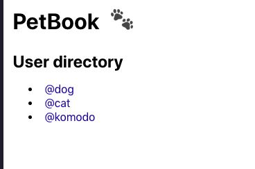
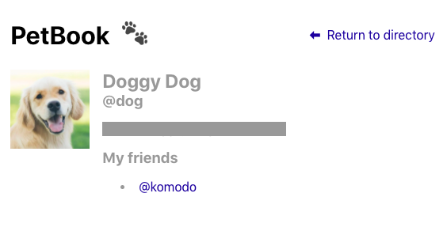

# Project

In this project, we’ll build a simple social network for pets. You’ll be able to view a pet’s profile (which contains their name, bio, and friend list) and navigate to other profiles. There will also be a profile directory where you can see all of the profiles.

## Available Scripts

In the project directory, you can run:

### `npm start`

Runs the app in the development mode.\
Open [http://localhost:3000](http://localhost:3000) to view it in the browser.

The page will reload if you make edits.\
You will also see any lint errors in the console.

